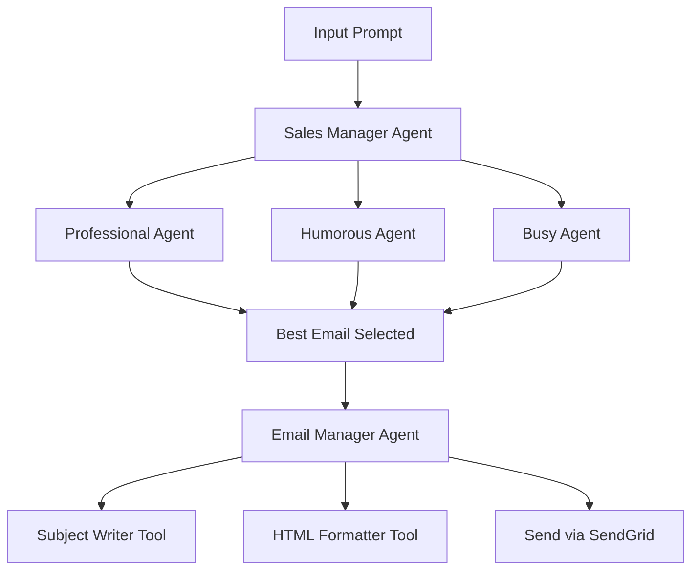

# SalesGPT-AI-Powered-Automated-Cold-Email-SDR-System
---
## 📌 Overview

**SalesGPT** is an end-to-end AI-driven **Sales Development Representative (SDR)** that automates the generation, refinement, and delivery of cold outreach emails. It simulates a team of specialized AI agents working together to deliver high-converting emails—professionally, humorously, or concisely—before selecting the best one and emailing it with real-time formatting and subject-line optimization.

This project showcases the **multi-agent collaboration architecture**, **tool usage**, **guardrails**, and **prompt chaining** concepts to build intelligent, structured agent workflows.

---

## 🚀 Demo Output

Given an input like:

> "Send a cold sales email addressed to the CEO of Salesforce."

SalesGPT will:

1. Generate 3 email drafts using 3 personas (professional, humorous, busy).
   
2. Select the best-performing email as judged by a manager agent.
   
3. Write an optimized subject line.
   
4. Convert the email to HTML.
   
5. Send the final version using the SendGrid API.

---

## 🧠 Agents & Tools

### 🤹 Sales Agent Personas

| Agent Type     | Behavior                                                   |
|----------------|------------------------------------------------------------|
| Professional   | Writes formal, polished, high-quality sales emails         |
| Humorous       | Uses wit and personality to catch the reader’s attention   |
| Busy           | Sends short and direct emails optimized for quick skimming|

### 🧠 Sales Manager Agent

- Delegates to all 3 agents.
  
- Compares results.
  
- Picks the best-performing email.
  
- Hands it off for formatting and sending.

### 📤 Email Manager Agent

- Generates a compelling subject line.
  
- Converts plain text to HTML.
  
- Sends the email via **SendGrid**.

### 🛡️ Guardrail Agent

- Detects personal names and prevents unsafe usage.

---

## 🔧 Technologies Used

| Tool/Library     | Purpose                                           |
|------------------|---------------------------------------------------|
| `openai-agents`  | To define and run AI agent workflows              |
| `groq`           | Fast inference using Groq-hosted GPT-4o           |
| `sendgrid`       | Real-world email delivery via SendGrid API       |
| `pydantic`       | Output validation and structured data handling    |
| `asyncio`        | For concurrent agent execution                    |
| `Colab`          | Fast prototyping and testing                      |

---
## 📈 Architecture

This project follows a modular agent toolchain approach:


---

## 🧪 How to Run

1. **Install dependencies**:
   ```bash
   pip install openai-agents groq sendgrid openai
   ```

2. **Set your API Keys**:
   ```python
   os.environ['GROQ_API_KEY'] = "your_key"
   os.environ['SENDGRID_API_KEY'] = "your_key"
   os.environ['OPENAI_API_KEY'] = "your_key"
   ```

3. **Run the notebook** in [Google Colab](https://colab.research.google.com) (recommended).

---

## 🎯 Project Highlights

- **Agent-based architectures**
  
- **Real API Integration (SendGrid, OpenAI, Groq)**
  
- **Simulates real-world enterprise workflows with AI**
  
- **Asynchronous orchestration and structured agent logic**
  
---

## 📬 Author

> Built by [Faiaz Ahmed](https://github.com/FaiazS) —  AI enthusiast. ✨

> For questions or feedback, feel free to reach out or create an issue.
